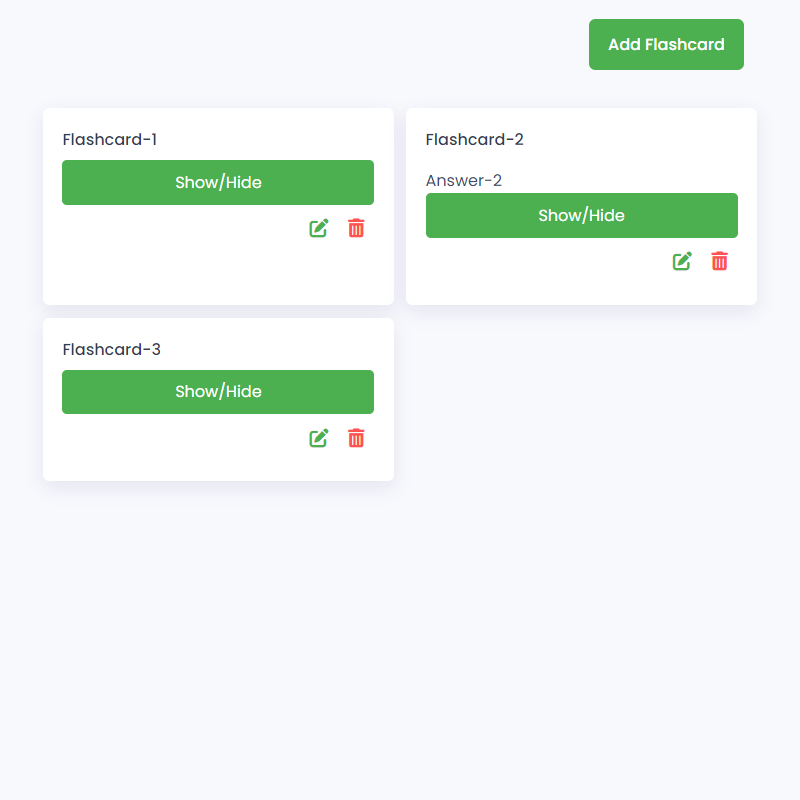

### Gameboy Tetris Clone

Here's what you'll learn:
🔹 Setting up the basic structure of our HTML file to accommodate flashcards.
🔹 Styling our flashcards with CSS to make them visually appealing and user-friendly.
🔹 Implementing JavaScript functionality to add, edit, delete, and show/hide answers on our flashcards.
🔹 Leveraging local storage to persist user-created flashcards, ensuring data persistence between sessions.

# Screenshot
Here we have project screenshot :

